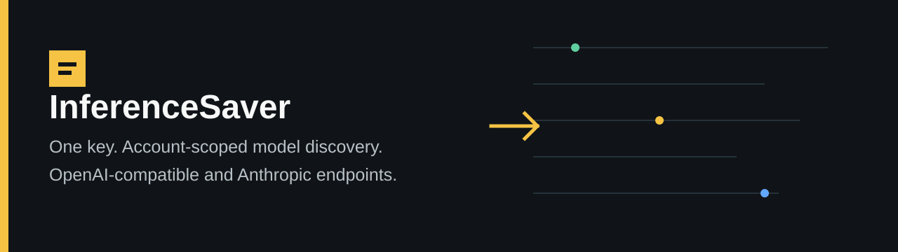

<div align="center">
  
</div>

<h1 align="center">InferenceSaver AI Gateway Starter</h1>

<p align="center">
  <a href="#features">Features</a> •
  <a href="#quick-start">Quick Start</a> •
  <a href="#usage">Usage</a> •
  <a href="#configuration">Configuration</a> •
  <a href="#media-model-capabilities">Media Capabilities</a>
</p>

---

## Features

- **OpenAI-compatible client** — drop-in replacement for `openai`, `@ai-sdk/openai`, and `@anthropic-ai/sdk`
- **Zero credential risk** — your API key stays on your machine; the starter never sends it elsewhere
- **Model catalog** — syncs available models on startup via `GET /v1/models`
- **Pricing catalog** — fetches live pricing from the public endpoint
- **Model selection** — pick the best model for a task based on capability, pricing, and availability
- **Media Model Capabilities** — watchdog aggregator that inspects video, audio, and image generation models across providers (Replicate, Fal.ai, Hugging Face)

## Quick Start

```bash
# Clone
git clone https://github.com/matthewdonsemail-lab/inferencesaver-ai-gateway-starter.git
cd inferencesaver-ai-gateway-starter

# Install
npm install

# Set your API key
export INFERENCESAVER_API_KEY="your-key-here"

# Run the smoke test
npm run smoke

# Sync the model catalog
npm run sync-models
```

## Usage

### OpenAI-compatible example

```typescript
import OpenAI from "openai";

const client = new OpenAI({
  baseURL: "https://api.inferencesaver.com/v1",
  apiKey: process.env.INFERENCESAVER_API_KEY,
});

const completion = await client.chat.completions.create({
  model: "gpt-5.4",
  messages: [{ role: "user", content: "Hello!" }],
});
```

### AI SDK example

```typescript
import { generateText } from "ai";
import { createOpenAICompatible } from "@ai-sdk/openai-compatible";

const provider = createOpenAICompatible({
  baseURL: "https://api.inferencesaver.com/v1",
  apiKey: process.env.INFERENCESAVER_API_KEY,
});

const result = await generateText({
  model: provider("gpt-5.4"),
  prompt: "Hello!",
});
```

## Configuration

| Variable | Required | Default | Description |
|---|---|---|---|
| `INFERENCESAVER_API_KEY` | Yes | — | Your InferenceSaver API key |
| `INFERENCESAVER_API_BASE_URL` | No | `https://api.inferencesaver.com` | API base URL |

## Media Model Capabilities

InferenceSaver maintains a **live model capability registry** for non-LLM models (video, audio, image generation). It aggregates capability metadata from:

- **InferenceSaver** — 17 native media models
- **Replicate** — 200+ models across 8 collections (text-to-video, text-to-image, audio, etc.)
- **Fal.ai** — 24 video/image/audio generation endpoints
- **Hugging Face** — 36 models across 12 pipeline tags

The capabilities are synced every 6 hours and include:
- Supported aspect ratios (9:16, 16:9, 1:1, etc.)
- Available durations
- Quality/resolution options
- Output formats
- Generation modes
- Reference image support
- Custom voice support
- Input/output types
- API endpoint URLs
- Schema documentation links

### Live Page

**[View the Media Model Capability Registry →](https://matthewdonsemail-lab.github.io/inferencesaver-ai-gateway-starter/)**

### Local Development

To run the aggregator locally:

```bash
# Set provider API keys (optional, without them you get InferenceSaver models only)
export REPLICATE_API_TOKEN="your-replicate-token"
export FAL_API_KEY="your-fal-key"
export HF_API_KEY="your-hf-key"

# Aggregate capabilities
npm run media-capabilities:aggregate

# Start the local server
npm run media-capabilities:serve
```

### Sync on demand

```bash
npm run sync-media-capabilities
```

### GitHub Actions

The capability registry is automatically synced every 6 hours via the `sync-media-capabilities.yml` workflow and deployed to GitHub Pages. You can also trigger it manually from the Actions tab. To add provider API keys, set the following repository secrets:

- `REPLICATE_API_TOKEN`
- `FAL_API_KEY`
- `HF_API_KEY`

---

## Submitting Model Capabilities

We welcome contributions from model providers. To add or update models in the registry:

1. **Fork the repository** and create a new branch
2. **Edit `data/media-capabilities.json`** — add your model entry following the schema in `src/media-capabilities/schema.ts`
3. **Run the validator**:
   ```bash
   npm run media-capabilities:validate
   ```
4. **Open a pull request** — the PR Checker workflow will automatically:
   - Validate the schema and data format
   - Check provider API connectivity (if API keys are configured)
   - Comment the validation results on the PR
   - Create a check with pass/fail status

### What the PR Checker validates

| Check | Description |
|---|---|
| Schema | Required fields exist (`id`, `provider`, `modelId`, `modality`, `capability`) |
| Modality | Must be one of `video`, `audio`, `image` |
| Capability | Must be one of `video_generation`, `image_generation`, `audio_generation`, `audio_transcription`, `motion_control` |
| Aspect ratios | Validated against common formats (`1:1`, `9:16`, `16:9`, `4:5`, `3:4`, `21:9`, `auto`) |
| Durations | Must be numeric, 1–3600s |
| Quality options | Validated against standard patterns (`480p`, `720p`, `standard`, `hd`, `pro`, etc.) |
| Consistency | Image models should have `aspectRatios`; audio models should have `outputFormats` |
| Duplicates | Duplicate `(provider, id)` pairs are flagged |
| API connectivity | Replicate, Fal.ai, and Hugging Face endpoints are tested (if secrets are set) |

### PR template

When submitting, use the [model submission template](.github/ISSUE_TEMPLATE/model-submission.md) to ensure all required information is included.

---

<p align="center">
  <sub>Built by <a href="https://inferencesaver.com">InferenceSaver</a></sub>
</p>